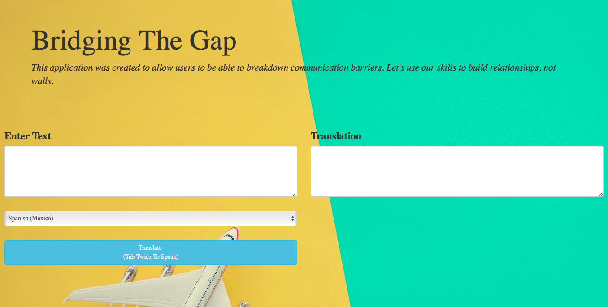

# btg-translator
This application was inspired after a conversation with an old friend. He informed me he was going on an adventure with his family to Portugal for five weeks. Even though, there are many language translating applications on the interwebs. I thought this would be an excellent opportunity to provide him with a web application that would help him communicate with the locals or even read the newspaper. 

Try it out for yourself.  https://btg-translator.herokuapp.com

/* REXX program to read dataset names from a PS file */

/* Specify the name of your PS file */
psFileName = 'your_ps_file.txt'

/* Open the PS file for reading */
parse upper arg psFileName
psFile = outtrap("lines.")
address tso "ALLOC F(INFILE) DSN('"psFileName"') SHR REUSE"
address tso "EXECIO * DISKR INFILE (STEM lines. FINIS"

/* Check for errors while opening the file */
if rc <> 0 then
   do
      say "Error opening the file. RC:" rc
      exit
   end

/* Process each line and display dataset names */
do i = 1 to lines.0
   /* Extract dataset name from the line */
   datasetName = line.i

   /* Display the dataset name */
   say datasetName
end

/* Close the file */
address tso "FREE F(INFILE)"

exit

/* Create a copy of the PDS */
   address tso "SUBMIT 'IEBCOPY INDD(SYSIN) OUTDD(OUTFILE) REPLACE'"
   "SYSIN." = "COPY INDD(INFILE("originalDatasetName")) OUTDD(OUTFILE("copyDatasetName"))"

   /* Check for errors while creating the copy */
   if rc <> 0 then
      say "Error creating the copy. RC:" rc

